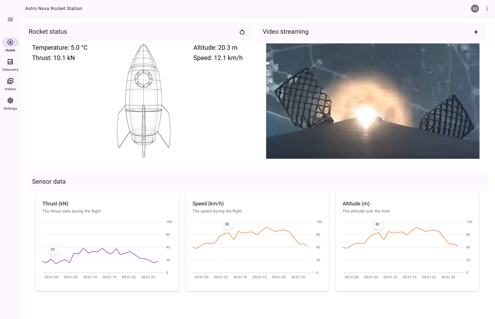

# Rocket Station Control

## Description

Rocket Station is an application designed to visualize and control rocket models. This project provides a user-friendly interface for interacting with and managing various aspects of rocket simulations or real-time rocket data. The application leverages Flutter's cross-platform capabilities to deliver a seamless experience across different devices.

The application includes a Telemetry page that displays sensor data charts for Thrust, Speed, and Altitude. The Telemetry page can be accessed from the left navigation rail by selecting the "Telemetry" destination.




## Getting Started

To get started with the Rocket Station project, follow these steps to set up your development environment and run the application on macOS.

### Prerequisites

- Ensure you have Xcode installed on your Mac.
- Install Flutter SDK version 3.6.0 or later.
- Install Dart SDK version 3.6.0 or later.

### Dependencies

The project relies on the following dependencies:

- flutter (SDK)
- cupertino_icons: ^1.0.8
- google_fonts: ^6.2.1
- provider: ^6.0.0
- flutter_svg: ^2.0.16
- fl_chart: ^0.66.0
- english_words: ^4.0.0

Dev dependencies:
- flutter_test (SDK)
- flutter_lints: ^5.0.0

### Setup and Launch

1. Clone the repository to your local machine:
   ```
   git clone https://github.com/your-username/rocket_station.git
   cd rocket_station
   ```

2. Install the project dependencies:
   ```
   flutter pub get
   ```

3. Open the project in your preferred IDE (e.g., Visual Studio Code or IntelliJ IDEA).

4. Ensure you have a macOS simulator running or a physical iOS device connected.

5. Launch the application:
   ```
   flutter run
   ```

   This command will build the app and launch it on the available macOS simulator or connected iOS device.

### Development

- To hot reload changes during development, press `r` in the terminal where the app is running.
- To perform a full restart, press `R` in the terminal.

For more information on Flutter development, check out the [Flutter documentation](https://docs.flutter.dev/).

## Architecture

TODO
